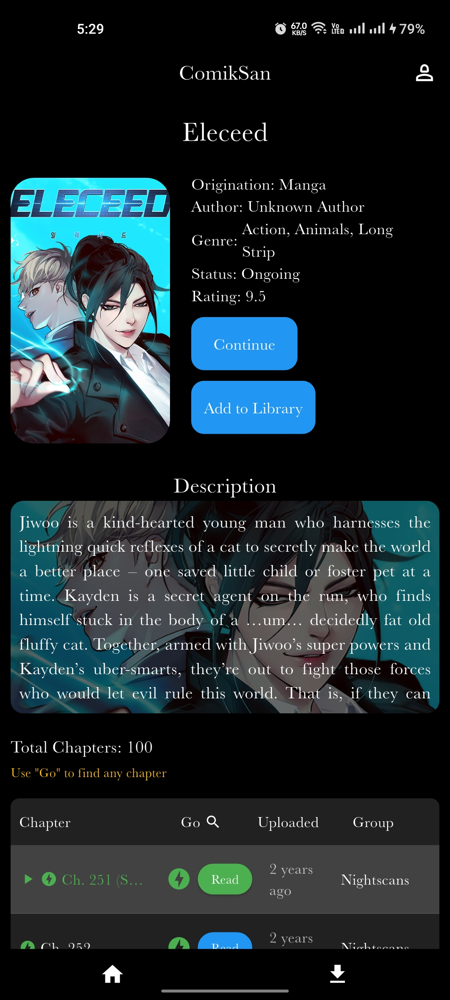
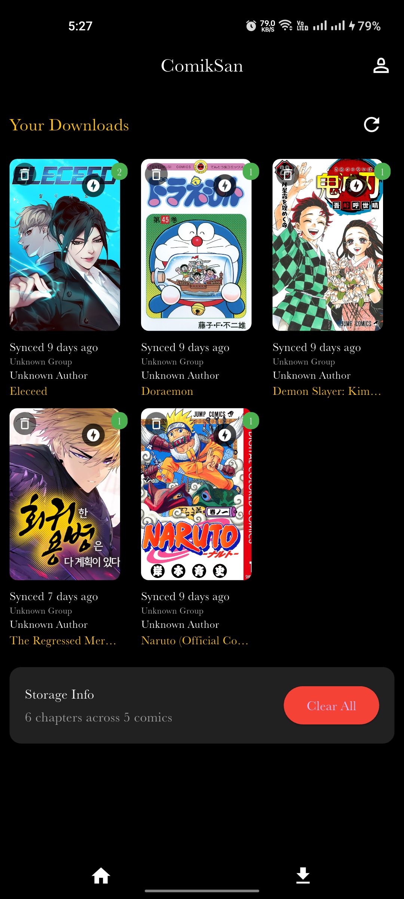
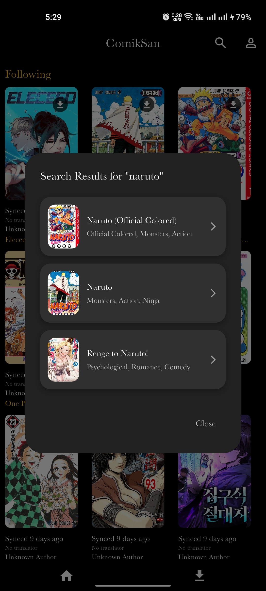

# ComikSan

A full stack manga/comic app built using **Flutter** for frontend and **.NET Web API** for backend.

## Overview

Users can browse, read, and download comics.  
The app supports offline mode, authentication via Firebase, and manga data fetched from the Mangadex API.

## Tech Stack

- Frontend: Flutter  
- Backend: .NET Web API  
- Database: SQLite + EF Core  
- Authentication: Firebase  
- API source: Mangadex API

## Project Structure

    comiksan/
    ├── flutter_frontend/      # UI + logic + Firebase
    └── dotnet_backend/        # API endpoints + DB + EF Core


## Main Features

- Browse and search manga  
- View manga details  
- Read chapters  
- Download for offline reading  
- Firebase auth (login/signup)  
- Backend handles all data securely via REST API

## Setup Instructions

### Frontend (Flutter)


```bash
flutter pub get
flutter run
```

### Backend (.NET)

```bash
cd dotnet_backend
dotnet restore
dotnet run
```


## Configuration

- Configure your Firebase project and add your own `firebase_options.dart`
- Do **not** commit `firebase_options.dart`, `google-services.json`, or `comic.db`


## Screenshots / Demo
 
### Home Page


### Comic Page


### Downloads Page


### Search Results



## Status

Final build – stable and working version.


```
